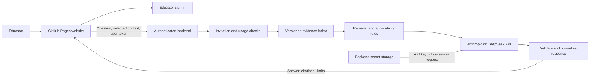

# AchieveGo educator bot: integration plan

September 13, 2026 · Planning document; no AI endpoint or account connection has been implemented

**Recommendation:** keep GitHub Pages for the website, add a small authenticated backend, and retrieve from a versioned AchieveGo evidence index before calling the model. Begin with an invited-educator pilot using fictional learners. Prefer Anthropic for the first citation-focused implementation, while keeping a DeepSeek adapter behind the same application interface.

**Confirmed by the project owner:** access should use login credentials for selected users, and both Anthropic and DeepSeek API accounts are available. Use a separate account for each educator, with public registration disabled. Anthropic-first remains the recommended implementation sequence; the backend platform and spending limits below are proposed choices. API billing is separate from a Claude chat subscription, as explained in [Anthropic's account documentation](https://support.claude.com/en/articles/9876003-i-have-a-paid-claude-subscription-pro-max-team-or-enterprise-plans-why-do-i-have-to-pay-separately-to-use-the-claude-api-and-console). DeepSeek documents its [API-key integration](https://api-docs.deepseek.com/). Enter keys directly into backend secret storage; do not share them in this conversation or put them in the prototype.

## 1. The educator experience

Add an **Ask AchieveGo** panel beside the existing learner and evidence views. Its purpose is to help educators understand evidence and turn it into a reviewable plan.

| Educator action | Useful bot response |
|---|---|
| “Why is this an option for Maya?” | Explain the confirmed mathematics goal, relevant grade scope, source evidence, and unresolved applicability questions |
| “Compare these two approaches.” | Compare targeted outcomes, populations, evidence frameworks, and implementation requirements without inventing a common effectiveness score |
| “What else should I assess?” | Identify missing information about the selected learning goal, strengths, access needs, and learner preferences; distinguish questions from diagnostic conclusions |
| “Help me plan the next four weeks.” | Draft activities and review checkpoints for educator approval; mark generated scheduling and adaptations as proposals, not as the studied intervention |
| “What evidence supports this for an autistic gifted student?” | Distinguish general intervention evidence from an unestablished profile-by-diagnosis effect, and identify the limits of this library |
| “What should I monitor?” | Suggest outcome-aligned observations and learner feedback, retaining separate unaided, accommodated, and AI-assisted performance conditions |

Each answer should show: a direct response, linked evidence, applicability limits, any proposed adaptation, and a useful next question. The source cards should remain accessible independently of the generated explanation. A citation to an evidence card is not a claim to have read the full underlying paper.

Use suggested prompts, a visible **Context being shared** preview, and explicit **Use this fictional scenario** / **Ask without a scenario** controls. Do not silently send selected diagnoses or previous chat turns. Keep chat session-only initially, provide Clear conversation, and make adding a proposed item to the review plan an educator action. A changed learner scenario should reset the context or request an explicit choice to carry it forward.

## 2. Architecture and where keys live

I recommend **Supabase Auth and Edge Functions** as the additional backend platform: it can provide educator sign-in, the server endpoint, and a database for invitation and usage controls in one project. GitHub Pages continues to serve the public interface. This is an architectural recommendation, not an existing account or deployment. Supabase documents [function authentication](https://supabase.com/docs/guides/functions/auth), [server-side secrets](https://supabase.com/docs/guides/functions/secrets), and [browser invocation/CORS](https://supabase.com/docs/guides/functions/cors).



The provider key exists only in backend secret storage and the server-to-provider authentication header. It never enters HTML, browser JavaScript, localStorage, a source map, the evidence index, model messages, or a response to the browser.

**GitHub Actions secrets do not make a browser application secret.** If a build substitutes a key into an HTML/JavaScript bundle, every visitor can recover it. The Pages workflow should publish only public configuration, such as the backend URL and intentionally public authentication configuration. Supabase's privileged secret/service-role credentials must also remain server-side. Its publishable key has a different purpose and must not be mistaken for user authentication or authorization.

The server chooses the provider endpoint and allowlisted model. The browser cannot supply an arbitrary upstream URL, credential, model name, system prompt, or token limit. This endpoint must not become a general-purpose proxy funded by your account.

An equivalent Cloudflare Worker backend is feasible if you prefer that platform; it supports [secret bindings](https://developers.cloudflare.com/workers/configuration/secrets/). The essential requirement is authenticated server-side provider access, not a particular vendor.

## 3. What “indexed” means for this demo

The initial knowledge base should contain the **12 existing evidence records**, source metadata, proposed applicability rules, and a reviewed explanation of the profiles and prototype boundaries. The full WWC download is an ingestion asset, not a curated knowledge base: it includes ineligible/non-meeting records and multiple review relationships.

Build a reproducible index from approved fields in `data/library.json`. Preserve:

- Stable evidence and source IDs, record type, title, and subject/need tags.
- Outcome, grade scope, population, original rating framework/value, and protocol/version where present.
- Source URL, locator, date checked, extraction status, and library version/hash.
- Known limitations, null/contradictory outcomes, and source discrepancies.
- A separate field identifying AchieveGo's proposed matching rationale.

At this size, use a metadata index and keyword search with reviewed synonyms. A vector database or fine-tuning is unnecessary for a first useful demo. When the curated collection becomes substantially larger, benchmark hybrid keyword/semantic retrieval against the initial method; Supabase supports [PostgreSQL full-text search](https://supabase.com/docs/guides/database/full-text-search). Do not add embeddings merely to describe the system as indexed AI.

Keep these retrieval steps explicit:

1. Validate the educator's question and selected context. Use server-side copies of evidence and rules; client-supplied ratings or candidate lists are not authoritative.
2. Separate a general evidence question from a request about a learner. For learner advice, confirm the targeted need rather than deriving it from a diagnosis.
3. Retrieve relevant evidence by goal, subject, and question. Compute applicability using the existing rules. Out-of-grade material can be discussed when explicitly relevant to a comparison, but remains clearly outside the learner's applicable scope.
4. Attach relevant companion outcomes and discrepancies, including negative/null findings, even if they rank poorly in a keyword search.
5. Pass a small evidence packet to the model. Keep evidence, proposed mapping, user context, and instructions distinguishable.
6. Return an explicit gap when the corpus cannot support an answer. For clear coverage gaps, a deterministic explanation can avoid an unnecessary provider call.

With only 12 records, it is practical to inspect all metadata before selecting a few documents; arbitrary top-k retrieval should not hide important contrary evidence. A match score measures retrieval relevance, never a student's predicted probability of benefit.

For later full-text indexing, add reviewed excerpts with precise locators and permission/reuse checks. Mark curated summaries as summaries. Indexing a paper does not validate either the intervention adaptation or its match to a learner.

## 4. Anthropic and DeepSeek integration

| Choice | Implementation approach | Decision criterion |
|---|---|---|
| Anthropic | Messages API with retrieved documents and native citations; normalize document pointers to AchieveGo evidence IDs | Convenient first option for source-linked explanations; still requires semantic evidence review |
| DeepSeek | Chat Completions API with the same retrieved evidence packet; require evidence IDs and validate the returned response | Suitable alternative using your API account; compare fidelity, latency, and observed cost on the same educator questions |

Anthropic's [citations feature](https://platform.claude.com/docs/en/build-with-claude/citations) supplies pointers into provided documents. This improves traceability, but a valid pointer does not prove that the cited evidence supports the model's inference. Its current documentation says native citations and strict structured outputs cannot be enabled together. Therefore, the Anthropic adapter should normalize citation-bearing text blocks into the application's response format, rather than assuming the provider returns our strict JSON schema.

DeepSeek provides [Chat Completions](https://api-docs.deepseek.com/api/create-chat-completion/) and [JSON output](https://api-docs.deepseek.com/guides/json_mode/). JSON formatting alone does not validate references, truth, or schema completeness. Reject empty/malformed responses and unknown evidence IDs, and derive source links from the server's library rather than accepting model-invented URLs.

Use one administrator-selected provider per deployment initially. Do not automatically send a failed request to another provider: that changes the recipient of educator context. A provider change should be deliberate and reflected in the interface. Select and verify an available model at implementation time; do not hard-code a model or cost assumption into this plan.

## 5. Authentication, spending, and confidentiality

Keeping the key hidden addresses only part of the problem. An unprotected backend could still let other people spend your API balance.

| Control | Proposed first implementation |
|---|---|
| Invited educators | Individual email/password accounts managed by the authentication service, disabled open enrollment, and a backend invitation/active-user check on every AI request; account setup/reset uses the service's supported flow |
| Verified identity | Validate token signature, issuer, audience, and expiry with supported verification tooling; do not merely decode a JWT or trust a client-supplied user ID |
| Request limits | Start with configurable limits of 5 requests/minute and 20/day per educator, 100/day across the demo, and one in-flight generation per educator |
| Bounded usage | Cap input length, context/history size, and output tokens; reserve usage atomically before dispatch so concurrent requests cannot evade the cap |
| Budget control | Set a separate demo budget and provider-side limits where available; estimate cost from the selected model's verified billing rules, reconcile usage, and retain a server-side kill switch |
| Restricted browser access | Allow the intended GitHub Pages origin and handle preflight correctly; CORS supplements authentication and is not an access-control substitute |
| Minimal logging | Store request ID, pseudonymous educator ID, model/provider, evidence/index version, latency, usage, and error category; omit prompts, diagnoses, answer bodies, credentials, and authorization headers by default |
| Safe presentation | Render escaped text or sanitized Markdown; construct citation URLs from the trusted library; suppress raw provider errors |

The numerical limits above are proposed pilot settings, not provider limits or guarantees about dollar expenditure. Budget reservations must account for concurrent and timed-out requests; an interrupted browser response may still incur provider usage. Account-level charges from other applications remain outside this bot's counters.

Use the backend's current [JWT verification support](https://supabase.com/docs/reference/javascript/auth-getclaims) plus an explicit active-user check. A valid login token alone does not establish that the user is invited to this pilot. Authentication redirect URLs should be restricted to the deployed site and explicit local development URLs.

If the demo is opened to everyone later, retain server-side quotas and budget controls and add abuse controls such as a [server-validated Turnstile challenge](https://developers.cloudflare.com/turnstile/get-started/server-side-validation/). A CAPTCHA is not educator identity and should not replace invitation authorization in the invited version.

For this demonstration, keep the existing fictional learner context and show **Use fictional examples; do not enter identifying student information** next to the input. No document/IEP upload in the first version. This instruction cannot technically prevent an educator from typing personal information; that possibility must be acknowledged in the sharing notice and release evaluation. The selected context and question will be transmitted to the named AI provider. No application transcript storage does not mean the provider has zero retention. Verify the chosen account's terms and data-handling settings before accepting real learner information.

Treat retrieved text and educator messages as untrusted content, not authority to override instructions. The model needs no access to secret storage, arbitrary websites, email, filesystem tools, or provider configuration. An instruction to reveal a key cannot reveal a key the model never receives.

## 6. Changes needed in this repository

| Existing component | Planned change |
|---|---|
| `data/library.json` | Generate a versioned index without changing the meaning of evidence ratings or mappings |
| `src/engine.js` | Reuse/test applicability rules on the server; the model does not control eligibility |
| `src/template.html`, `src/styles.css`, `src/app.js` | Educator chat panel, context preview, sign-in state, citation links, clear conversation, and explicit add-to-plan action |
| New backend directory | Authenticated endpoint, retrieval, provider adapters, response normalization, quota reservations, and health/configuration status |
| New public configuration | Backend URL and public auth settings only; bot disabled gracefully if unconfigured |
| `scripts/build.py` and site tests | Continue publishing an explicit static-file allowlist and reject secret/configuration leakage |
| `scripts/package_release.py` | Harden source packaging before adding backend configuration; include backend source using an explicit allowlist, excluding all local secrets and deployment state |
| Deployment documentation/workflows | Separate public-site publication from backend deployment and secret provisioning |

**A concrete issue to address before implementation:** the current repository ZIP builder recursively includes files within selected source directories. `.gitignore` does not govern Python ZIP packaging. A future ignored `.env` placed under one of those directories could still enter a release ZIP. The packaging change and a dummy-secret exclusion test belong in the first implementation phase, before real credentials are configured. No existing credential exposure is asserted here.

The frontend and backend should publish compatible index versions. Include `library_version` and `index_hash` in requests/responses; reject or refresh stale learner-plan context rather than explaining one version while displaying another. A public health endpoint can report readiness and version, but never secret values or privileged configuration.

## 7. Proposed request and response contract

The browser sends an authenticated request with a message, task type, optional fictional context, selected evidence IDs, bounded history, and index version. It sends no provider key or privileged settings.

```json
{
  "task": "explain_match",
  "message": "Why is mathematical reflection relevant here?",
  "context": {
    "synthetic": true,
    "grade": 7,
    "subject": "math",
    "profile": "P2",
    "needs": ["math_reflection", "advanced"],
    "documented_labels": ["adhd"]
  },
  "evidence_ids": ["math-reflection"],
  "library_version": "0.1.0"
}
```

The backend normalizes provider output into answer blocks, evidence references, limitations, proposed adaptations, and follow-up questions. It independently attaches authoritative source cards, applicability results, and provenance. A citation/reference validator can detect unknown IDs and contradictory structured metadata; it cannot fully prove that generated prose is supported. That limitation belongs in the evaluation, not behind a claim of guaranteed factuality.

For the initial release, validate the completed response before displaying it. Streaming can be added later when partial-answer handling and citation validation are reliable. On provider failure, preserve the ordinary evidence library and display an honest unavailable message; do not present a canned response as a live AI answer.

## 8. Implementation order and acceptance checks

1. **Secure backend skeleton:** fix packaging exclusions, configure sign-in and invitation checks, add secret bindings, quotas, and a mock provider. Demonstrate that unauthorized requests never reach a provider call.
2. **Evidence index and retrieval:** generate the index, share applicability rules, and test matching/companion-outcome retrieval independently of an LLM.
3. **One real provider:** configure the key directly in backend secret storage, integrate citations, and run a small synthetic evaluation. No API key needs to pass through chat, Git, or a Pages build.
4. **Educator interface:** add suggested prompts, context confirmation, citation inspection, graceful failure, and explicit plan additions. Deploy the authenticated demo after local and staging checks.
5. **Provider comparison and educator pilot:** evaluate the second adapter on the same prompts, then collect educator feedback about clarity, usefulness, workload, and misconceptions.

Proposed acceptance set: the existing five scenarios plus approximately 25 educator/adversarial questions. Include diagnosis-only requests, an uncertain profile, missing need, a grade mismatch, a well-being gap, the Check & Connect null completion result, an attempt to override instructions, an invented citation, and a provider timeout. Require all deterministic security/boundary tests to pass; have knowledgeable reviewers assess whether citations support the substantive claims and whether proposed plans preserve challenge and implementation fidelity.

Also inspect the built page, source maps if introduced, network requests, logs, release ZIPs, and errors with a dummy secret. Test anonymous, expired-token, uninvited-user, quota-exhausted, concurrent-request, and stale-index cases. Test at the actual GitHub project subpath, not just localhost root. AI/provider comparison should measure observed cost and latency as well as evidence fidelity.

The resulting first bot would demonstrate **conversation grounded in a curated library and a reviewable planning workflow**. It would not establish clinical validity, optimal interventions for profile/diagnosis combinations, or causal benefit from AI personalization.
